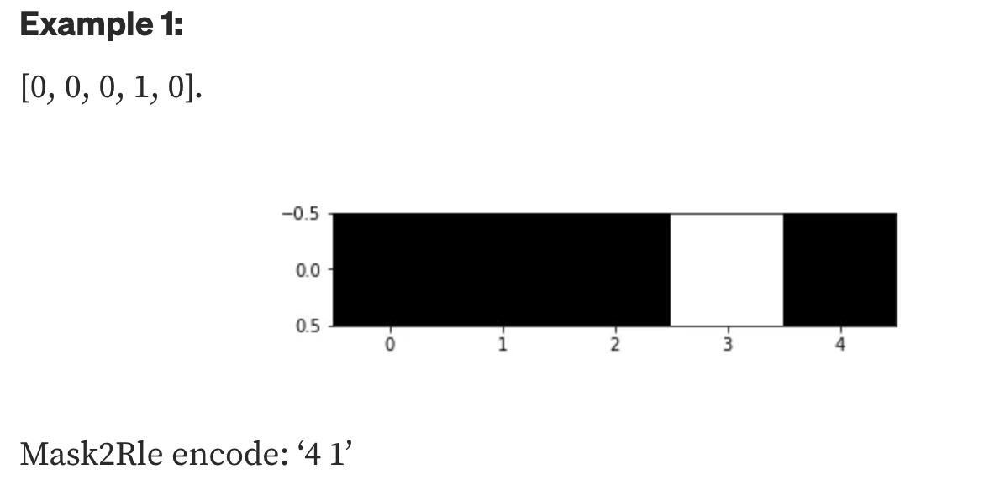
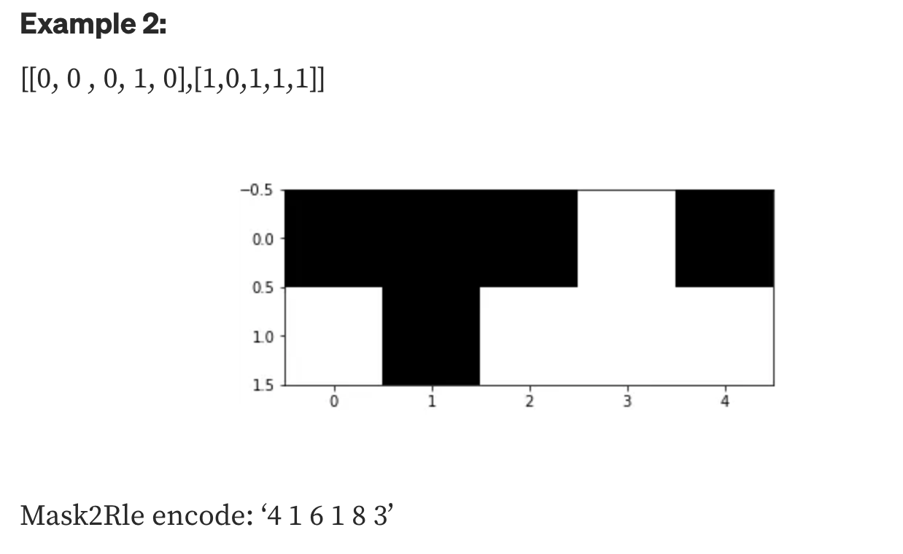
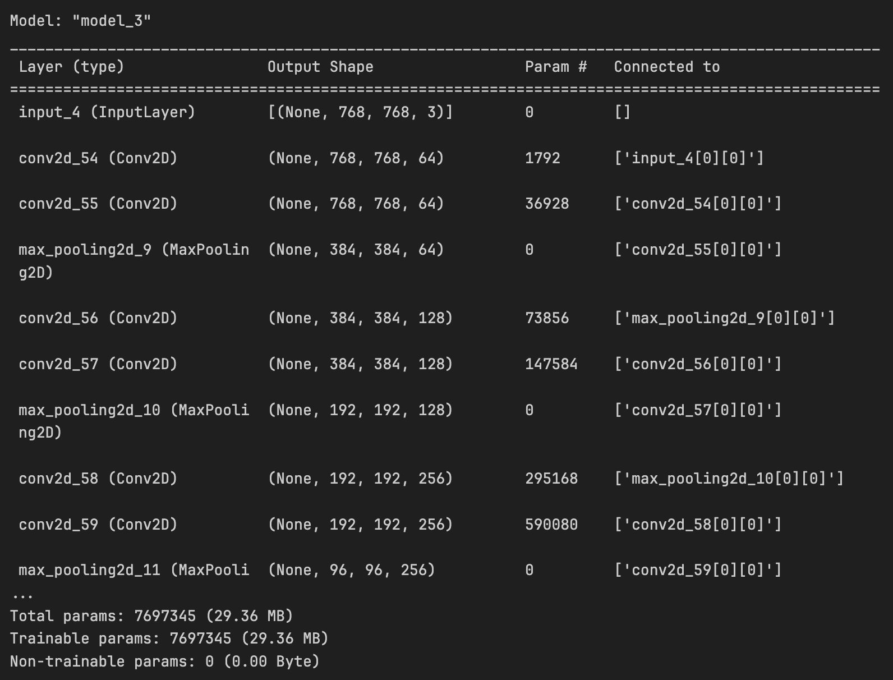

# Airbus Ship Detection Challenge

This repository contains code, exploratory data analysis, and resources for the Airbus Ship Detection Challenge.

## Table of Contents
- [Airbus Ship Detection Challenge](#airbus-ship-detection-challenge)
  - [Table of Contents](#table-of-contents)
  - [Introduction](#introduction)
  - [Dataset](#dataset)
  - [Installation](#installation)
  - [Usage](#usage)
  - [Model Architecture](#model-architecture)
  - [Training](#training)
  - [Evaluation](#evaluation)
  - [References](#references)

## Introduction
The goal of this challenge is to develop a model that can accurately outline ships in satellite images. The dataset consists of satellite images along with corresponding ship masks. The images have a resolution of 768x768 pixels. The ship masks are binary masks where white pixels represent ship regions and black pixels represent background regions. 

## Dataset
The dataset for this challenge consists of training images and corresponding ship masks. The ship masks are presented in the CSV file and encoded using the run-length encoding (RLE) technique. The RLE technique is used to represent binary masks in a compact form. The RLE-encoded masks are stored in the `EncodedPixels` column of the CSV file.

The example of how the RLE technique works is shown below:



[Source](https://ccshenyltw.medium.com/run-length-encode-and-decode-a33383142e6b)

## Installation
1. Clone the repository:
```shell 
git clone Airbus-Ship-Detection
cd Airbus-Ship-Detection
```

2. Set up the Python environment and install the required dependencies:
```shell
python3 -m venv venv
source venv/bin/activate
pip install -r requirements.txt
```

3. Download the dataset (you should have such structure):
```shell
airbus-ship-detection/
├── airbus-ship-detection/
│ ├── test_v2/
│ ├── train_v2/
│ ├── sample_submission_v2.csv
│ └── train_ship_segmentations_v2.csv
├── images/
├── ship_detection_eda.ipynb
├── train.py
├── evaluate.py
├── README.md
└── requirements.txt
```

4. Most of the useful information is located in the Jupyter Notebook ```ship_detection_eda.ipynb```. The notebook contains exploratory data analysis, code for training the model, as well as sample code for model evaluation.

## Usage
To train and evaluate the ship detection model, follow these steps:


1. Train the model:
```shell
python3 train.py
```


1. Evaluate the model on the test set:
```shell
python3 evaluate.py
```

## Model Architecture
The model architecture used for ship detection is based on the U-Net model. U-Net is a popular architecture for image segmentation tasks, known for its ability to capture both local and global context information effectively. The model consists of an encoder pathway for feature extraction and a corresponding decoder pathway for upsampling and generating the final segmentation map.

The breakdown of my model's architecture:

* Input layer: The input shape is specified, and an input tensor is created.

* Contracting path (encoder):

  * Two convolutional layers with 64 filters, followed by ReLU activation and padding.
  * Max pooling with a pool size of (2, 2) to downsample the feature maps.
  * Two more sets of convolutional layers and max pooling, gradually increasing the number of filters to 128 and 256.
* Bottom of the U-Net:

  * Two convolutional layers with 512 filters, maintaining the spatial dimensions of the feature maps.
  * Expanding path (decoder):

* UpSampling2D layer with a size of (2, 2) to upsample the feature maps.
* Convolutional layer with 256 filters, followed by ReLU activation and padding.
* Concatenation with the corresponding feature maps from the contracting path.
* Two more sets of convolutional layers and upsampling, gradually decreasing the number of filters to 128 and 64.
* Output layer: A convolutional layer with 1 filter and a sigmoid activation function to generate the final segmentation map.

* Model creation: The inputs and outputs are specified to create the model using the Model class from Keras.


The model can be created by passing in the input shape as a tuple to the constructor of the Model class. 


The model summary is shown below:



## Training
The training process involves optimizing the model parameters using a combination of binary cross-entropy loss and the Dice coefficient. The Adam optimizer is used with default parameters.

## Evaluation
Evaluation could only be done through the Kaggle platform. However, due to the inconsisntency of the results, the evaluation is not included in this repository. The model I created was heavily biased towards the empty images, which resulted in a low score. After trying to make the dataset more balanced, the model still was not predicting the non-empty images correctly. So, the binary accuracy was very high, but the true positive rate was quite low. The model was trained for 5 epochs, and the loss was decreasing with each epoch. 


## References
1. [Airbus Ship Detection Challenge](https://www.kaggle.com/c/airbus-ship-detection)
2. [Image segmentation with a U-Net-like architecture](https://keras.io/examples/vision/oxford_pets_image_segmentation/)
3. [A detailed example of how to use data generators with Keras](https://stanford.edu/~shervine/blog/keras-how-to-generate-data-on-the-fly)
4. [Run-Length Encode and Decode](https://www.kaggle.com/code/paulorzp/run-length-encode-and-decode/script)
